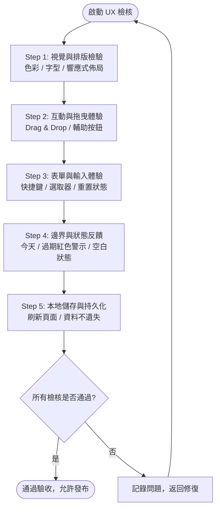

# UX 體驗與介面易用性檢核工作流程 (UX Check Workflow)

本工作流程定義了在進行新功能發布、UI 樣式重構或版本迭代時，針對「簡約暖色任務看板」進行全方位使用者體驗 (UX)、介面互動 (UI) 與無障礙易用性 (Usability) 的標準驗收檢核清單與操作步驟。

---

## 1. 檢核目標與觸發時機 (Objective & Triggers)

* **適用情境**：
  * 新增或修改 UI 元件（如表單輸入、按鈕、卡片標籤）。
  * 調整 CSS 設計代幣、間距或色彩排版。
  * 每次建立 Git 提交與部署至 GitHub Pages 前。
* **核心標準**：
  * 操作零挫折感、即時視覺反饋、無破版現象、符合直覺的人體工學操作體驗。

---

## 2. 檢核作業流程圖 (Workflow Lifecycle)



---

## 3. 逐步檢核清單 (Step-by-Step Checklist)

### Step 1: 視覺一致性與版面檢驗 (Visual & Layout)
- [ ] **色彩代幣一致性**：頁面底色 (`--bg-page`)、欄位底色 (`--bg-column`) 與主色調 (`--accent-primary`) 是否嚴格遵循設計系統，無突兀的自訂色彩。
- [ ] **文字對比度與階層**：文字與背景對比度是否滿足 WCAG AA 標準（>= 4.5:1），標題與正文字級對比分明。
- [ ] **桌面版平鋪佈局**：在視窗寬度 >= 1024px 下，To-do、Process、Done 三欄是否並排平鋪且寬度均勻。
- [ ] **行動端適應性**：在視窗寬度 <= 768px（或手機尺寸）下，版面是否自適應垂直堆疊或保持舒適橫向捲動，無水平破版或文字溢出。

### Step 2: 互動流暢度與拖曳檢驗 (Interactions & Motion)
- [ ] **拖曳起手體驗 (Dragstart)**：抓住卡片時，是否呈現微幅縮放與半透明紙張效果 (`.dragging`)，無卡頓延遲。
- [ ] **目標放置反饋 (Dragover)**：懸停於目標欄位上方時，目標欄位是否即時呈現邊框與背景高亮 (`.drag-over`)，指引明確。
- [ ] **跨欄快捷切換按鈕**：
  - To-do 欄位卡片是否提供 `進行中 ›` 推進按鈕。
  - Process 欄位卡片是否提供 `‹ 待辦` 與 `完成 ›` 雙向按鈕。
  - Done 欄位卡片是否提供 `‹ 返回進行中` 回退按鈕。
  - 點擊按鈕後卡片是否立即平滑移動至目標欄位最前排。

### Step 3: 表單輸入與微互動 (Form & Micro-interactions)
- [ ] **輸入快捷操作**：輸入任務名稱後按下 `Enter` 鍵，能否直接送出任務並清空文字框。
- [ ] **焦點自動保持**：任務建立完成後，游標是否自動聚焦 (`focus()`) 回輸入框，支援連續新增。
- [ ] **類別切換體驗**：工作 (Work) 與生活 (Life) 單選按鈕切換時，圓點與標籤外觀是否即刻變化。
- [ ] **優先度選擇**：High (紅)、Medium (橙)、Low (灰) 標籤點選狀態是否清晰可辨，預設值為 Medium。
- [ ] **截止日期欄位**：
  - 選填性質：未填寫日期時是否可順暢送出，不出現任何警告阻擋。
  - 送出後重置：任務送出後，日期選取器是否自動重置為空白。

### Step 4: 狀態反饋與邊界測試 (Edge Cases & Alerts)
- [ ] **截止日期標籤渲染**：
  - 有填寫日期：卡片頂部標籤列是否顯示 `📅 YYYY/MM/DD` 規格文字。
  - 未填寫日期：卡片不產生多餘空白或未定義佔位符。
- [ ] **到期警示正確性**：
  - **今天到期**（日期 = 今日）：標籤是否呈現顯目的紅色樣式 (`.due-date-badge.overdue`)。
  - **已過期**（日期 < 今日）：標籤是否同樣高亮為紅色警示。
  - **未來日期**（日期 > 今日）：標籤是否維持低調柔和的暖灰底色。
- [ ] **欄位空白狀態 (Empty States)**：當某欄位無任何卡片時，是否顯示友善的空狀態圖示與指引文字（例如「暫無待辦，新增一個吧！」）。
- [ ] **防範 XSS 注入**：輸入特殊 HTML 符號（如 `<script>alert(1)</script>`）能否正確被跳脫顯示為純文字。

### Step 5: 資料持久性與穩定度 (Persistence & Consistency)
- [ ] **重新整理維持狀態**：新增、刪除、跨欄移動、修改分類或優先度後，重新整理瀏覽器頁面 (F5)，確認所有欄位卡片順序與狀態完全一致。
- [ ] **分類篩選切換**：在「全部 / 工作 / 生活」頁籤間切換時，三欄是否同步過濾，且卡片計數徽章保持即時準確。
- [ ] **進度條同步更新**：當任務在各欄間轉移或清空完成項目時，頂部百分比進度條與完成計數是否即時無誤。

---

## 4. 驗收評估等級標準 (Grading Criteria)

| 評估等級 | 判定標準 | 建議行動 |
| :--- | :--- | :--- |
| 🟢 **Pass (通過)** | 所有 Checkbox 項目全數通過，無任何阻礙性 UX 瑕疵。 | 允許發布至生產環境 (Production) 或部署 GitHub Pages。 |
| 🟡 **Minor (輕微瑕疵)** | 僅有非關鍵視覺微距偏差（如 1~2px 間距未對齊），核心互動與資料存取均正常。 | 紀錄於待辦事項 (TODO)，可在次要迭代中調整。 |
| 🔴 **Block (重大阻礙)** | 拖曳失效、表單無法送出、日期判斷錯誤、刷新頁面資料遺失或明顯破版。 | **立即阻擋發布**，退回開發人員修正後重新執行本檢核。 |

---

## 5. 檢核報告範本 (Output Report Template)

執行本檢核後，請依以下格式輸出簡報：

```markdown
### 📋 UX 檢核報告
- **檢核日期**：YYYY/MM/DD
- **測試環境**：Chrome / Edge / Safari (視窗解析度: 1920x1080 & 375x812)
- **檢核結果**：🟢 Pass / 🟡 Minor / 🔴 Block
- **重點發現**：
  1. [項目說明]：正常 / 需優化
- **後續行動**：允許發布 / 待修復項清單
```
