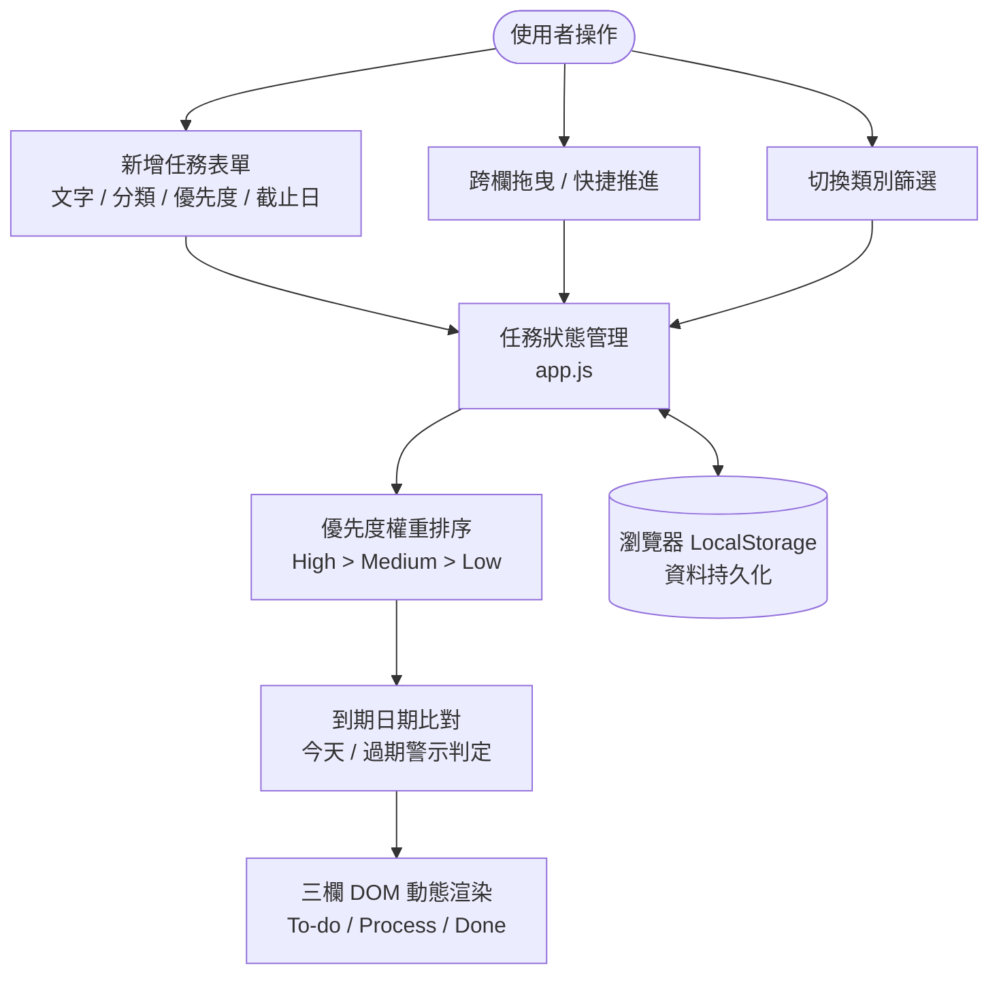

# 簡約暖色任務看板 (Minimalist Warm Kanban)

> 專為提升日常生產力與專注度打造的輕量三欄式任務看板。結合溫潤暖色調視覺設計、流暢的卡片拖曳互動，以及完整的任務優先度與到期提醒系統。

[](https://a0919943347-cell.github.io/kanban-app/)
[](https://github.com/a0919943347-cell/kanban-app)
[](#-技術堆疊)
[](#-版權授權)

---

## 📖 目錄 (Table of Contents)
- [專案簡介](#-專案簡介)
- [核心功能特色](#-核心功能特色)
- [系統架構與資料流](#-系統架構與資料流)
- [檔案結構](#-檔案結構)
- [技術堆疊](#-技術堆疊)
- [本機快速啟動](#-本機快速啟動)
- [部署指南 (GitHub Pages)](#-部署指南-github-pages)
- [版本維護規範](#-版本維護規範)

---

## 💡 專案簡介

本專案是一個基於 **純前端原生技術 (Vanilla HTML5 / CSS3 / JavaScript)** 打造的高效能任務管理工具。捨棄龐大重型框架，實現零依賴、開箱即用、毫秒級載入的極致體驗。

介面靈感來自現代 Notion 與簡約紙本筆記的溫暖美學，幫助個人與團隊輕鬆釐清工作與生活邊界，直覺推進每項代辦事項。

---

## ✨ 核心功能特色

### 1. 三欄看板工作流 (Kanban Workflow)
* **To-do（待辦事項）**：新建立的任務預設進入此欄位，作為任務暫存與啟動區。
* **Process（進行中）**：專注當下正在推進的核心任務，避免同時處理過多項目。
* **Done（已完成）**：記錄已達成的成就，卡片帶有柔和完成樣式，並支援一鍵批次清空。

### 2. 直覺卡片拖曳與快捷切換 (Drag & Drop)
* 採用原生 **HTML5 Drag and Drop API**，支援在三欄間流暢拖拉卡片，放置目標欄位自動呈現高亮反饋。
* 每張卡片皆提供 **輔助移動按鈕**（例如 `進行中 ›`、`完成 ›`），在觸控裝置或純鍵盤操作下亦能輕鬆推進階段。

### 3. 任務截止日期與紅色到期警示 (Due Date & Alerts)
* **選填截止日期**：表單支援日期選擇器，填寫後卡片自動顯示 `📅 YYYY/MM/DD` 規格標籤。
* **智能色彩識別**：
  * 若任務日期為 **今天** 或 **已過期**，標籤自動轉為 **鮮明紅色高亮** (`.due-date-badge.overdue`)，提醒立即處理。
  * 若日期在 **未來**，則顯示為典雅的低調暖灰色。

### 4. 任務優先度階層與自動排序 (Priority Sorting)
* 支援 **High（高）**、**Medium（中）**、**Low（低）** 三種優先級別。
* 各欄位卡片自動依據優先級權重（High > Medium > Low）降冪排序，確保最關鍵的事項永遠置頂。

### 5. 分類即時篩選 (Category Filter)
* 提供 **工作 (Work)** 與 **生活 (Life)** 雙分類標記。
* 頂部提供即時篩選標籤頁（全部 / 工作 / 生活），即刻切換視野，工作生活切換自如。

### 6. 即時進度統計與資料持久化 (Persistence)
* 頂部進度條即時計算整體任務完成率 (`已完成 / 總數 (%)`)。
* 整合瀏覽器 `localStorage`，所有新增、修改、刪除與拖曳位置皆即時儲存，關閉或重新整理頁面資料不遺失。

---

## 🏗️ 系統架構與資料流



---

## 📁 檔案結構

```text
kanban-app/
├── index.html                  # 應用程式主頁面結構與表單元件
├── style.css                   # 簡約暖色設計系統、看板網格與響應式排版樣式
├── app.js                      # 狀態機、拖曳邏輯、日期計算與 LocalStorage 引擎
├── .agents/
│   └── rules/
│       └── docs-writing.md     # 專案文件與規格撰寫遵循規範
├── .gitignore                  # Git 版本控制忽略清單
└── README.md                   # 專案詳細說明文件
```

---

## 💻 技術堆疊

| 領域 | 技術項目 | 說明 |
| :--- | :--- | :--- |
| **HTML** | Semantic HTML5 | 語意化結構、Form 表單控制、Drag & Drop API |
| **CSS** | CSS3 / CSS Variables | 設計 Token 系統、Flexbox & Grid 混合佈局、CSS 動畫 |
| **JavaScript** | Modern Vanilla JS (ES6+) | 原生模組、DOM 操作、事件委派、localStorage API |
| **字型** | Google Fonts | Plus Jakarta Sans、Noto Sans TC |
| **部署** | GitHub Pages | 靜態雲端自動化託管與發布 |

---

## 🚀 本機快速啟動

無需安裝任何套件或伺服器環境，即可在本機運行：

### 方式 1：直接開啟
以任何現代瀏覽器（Chrome, Edge, Safari, Firefox）直接雙擊開啟 `index.html` 檔案即可開始使用。

### 方式 2：使用簡易本地伺服器
若習慣透過本機伺服器預覽，可使用 Python 或 Node.js：

```bash
# 使用 Python 內建伺服器 (連接埠 8000)
python -m http.server 8000

# 或使用 Node.js 的 npx serve
npx serve .
```
瀏覽器訪問 `http://localhost:8000` 即可體驗完整功能。

---

## 🌐 部署指南 (GitHub Pages)

本專案為純靜態架構，可無縫託管於 GitHub Pages：

1. **推送至遠端儲存庫**：
   ```bash
   git add .
   git commit -m "feat: 更新看板功能與文件"
   git push origin main
   ```
2. **啟用 GitHub Pages**：
   * 進入 GitHub 儲存庫的 **Settings** > **Pages**。
   * **Source** 選擇 `Deploy from a branch`。
   * 分支選擇 `main` 或 `gh-pages`，路徑設為 `/ (root)` 後點擊 **Save**。
3. **完成發布**：
   * 幾秒鐘後即可透過公開網址 `https://<你的帳號>.github.io/<儲存庫名稱>/` 進行訪問。

---

## 📋 版本維護規範

> [!NOTE]
> 本專案所有文件、規格擴充與代碼變更，請嚴格遵循 [`.agents/rules/docs-writing.md`](file:///.agents/rules/docs-writing.md) 規範執行。

---

## 📄 版權授權

本專案採用 [MIT License](LICENSE) 開源授權，歡迎自由修改、學習與個人商業使用。
