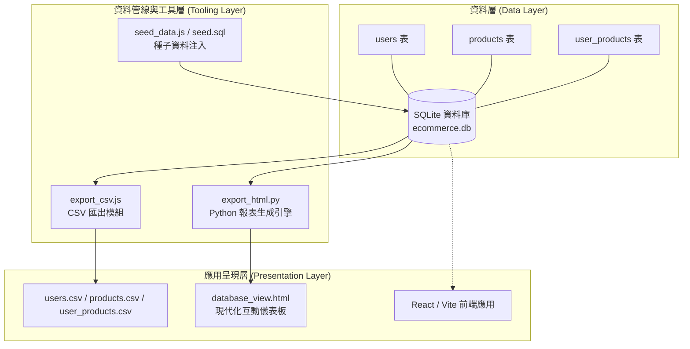
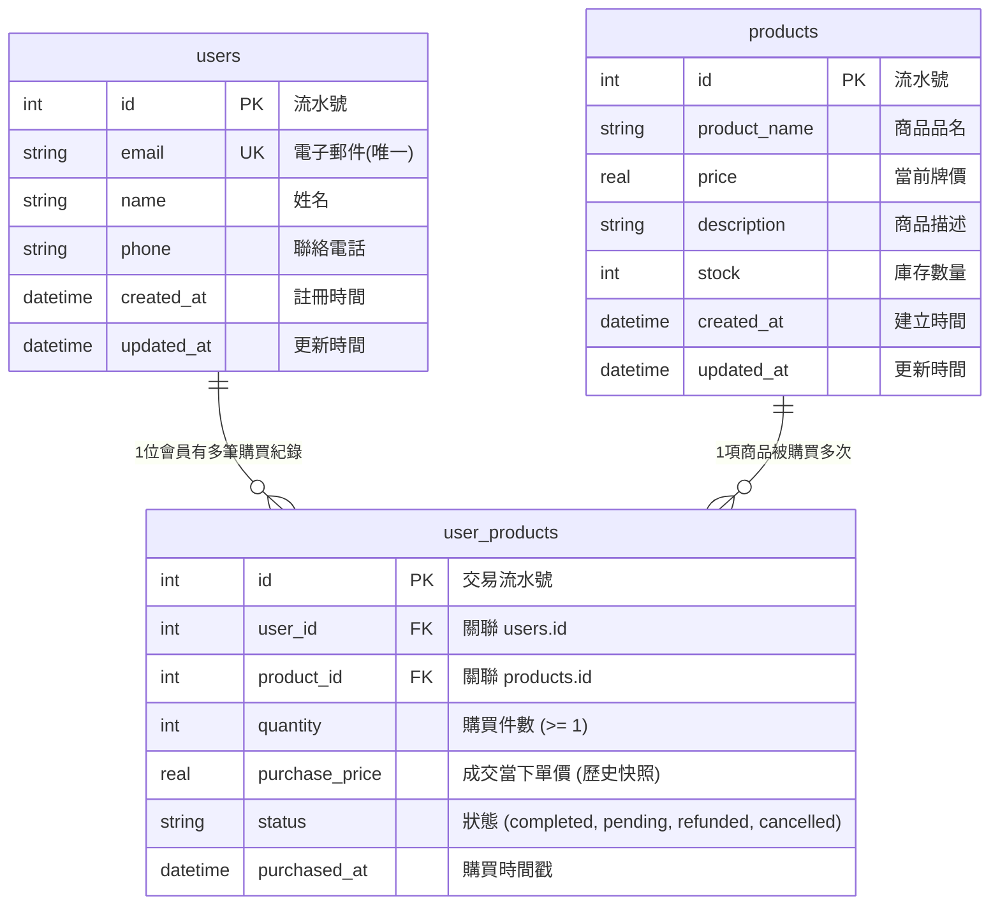

# 產品需求規格書 (Product Requirements Document, PRD)

## 專案名稱：電商會員與購買紀錄管理系統 (E-Commerce Member & Purchase Management System)

---

| 項目 | 內容說明 |
| :--- | :--- |
| **文件版本** | v1.0.0 |
| **文件狀態** | 正式版本 (Approved) |
| **撰寫時間** | 2026-09-05 |
| **專案負責人** | AI PM / Antigravity |
| **目標讀者** | 產品經理 (PM)、全端工程師、資料分析師、系統架構師 |

---

## 一、專案背景與願景 (Project Background & Vision)

### 1.1 背景說明
在電商與線上零售業務的初期原型驗證（MVP）與中小型管理情境中，建立一套輕量、易維護且具備完整關聯式結構的資料庫系統，是實現會員管理與訂單追蹤的核心基礎。本系統採用 **SQLite** 作為輕量化資料儲存引擎，結合 **Python / Node.js 資料管線** 與 **現代化 HTML 視覺化儀表板**，提供一套開箱即用、零依賴、具備完整 ACID 事務特性的原型解決方案。

### 1.2 產品願景
打造一套具備商業級設計標準（支援歷史成交價快照、外鍵關聯完整性約束、索引優化）且便於視覺化檢驗的輕量級電商會員與購買管理系統，降低開發門檻與維運成本。

---

## 二、目標用戶與使用情境 (User Personas & Use Cases)

| 角色 (Persona) | 主要痛點 | 期望目標與使用情境 |
| :--- | :--- | :--- |
| **電商營運人員 (Operator)** | 無法直觀檢視會員消費習慣與熱門商品 | 透過視覺化儀表板快速掌握會員清單、熱銷商品排名及訂單狀態分佈。 |
| **產品經理 (PM / Analyst)** | 需要定期導出數據進行 Excel 樞紐分析或報告產出 | 能一鍵匯出相容 Windows Excel 且不亂碼的標準 CSV 報表。 |
| **後端/全端工程師 (Developer)** | 需要穩固且規範的關聯式資料庫結構做為 API 介接基礎 | 具備完整 Schema 定義（主外鍵約束、CHECK 驗證、索引優化）與種子資料產生腳本。 |

---

## 三、系統架構與技術棧 (System Architecture & Tech Stack)

### 技術選型
* **資料庫 (Database)**：SQLite 3（檔案路徑：`ecommerce.db`）
* **資料庫管理與初始化**：Node.js v24 原生 `node:sqlite` 與 SQL 腳本 (`schema.sql`, `seed_data.js`)
* **資料分析與報表引擎**：Python 3.12 原生 `sqlite3` 與字串模板生成器 (`export_html.py`)
* **呈現層**：獨立單檔 HTML5 + CSS3 + Vanilla JavaScript，相容現代瀏覽器與 Windows Excel。

---

## 四、資料模型規格 (Data Model & Schema Specifications)

### 4.1 實體關聯圖 (ER Diagram)

### 4.2 核心欄位設計與業務邏輯約束

#### 1. 會員表 (`users`)
* **`id`** (INTEGER, PK, AUTOINCREMENT)：會員唯一代號。
* **`email`** (TEXT, NOT NULL, UNIQUE)：會員電子郵件，具備唯一性索引，防止帳號重複。
* **`name`** (TEXT, NOT NULL)：會員姓名。
* **`phone`** (TEXT)：手機或聯絡電話，採 TEXT 格式儲存以相容國際碼與連字號。
* **`created_at` / `updated_at`** (DATETIME)：預設為系統當前時間 (`CURRENT_TIMESTAMP`)。

#### 2. 商品表 (`products`)
* **`id`** (INTEGER, PK, AUTOINCREMENT)：商品識別碼。
* **`product_name`** (TEXT, NOT NULL)：商品名稱。
* **`price`** (REAL, NOT NULL, `CHECK(price >= 0)`)：商品上架牌價，透過 CHECK 限制防止負數輸入。
* **`description`** (TEXT)：商品詳細文案與規格說明。
* **`stock`** (INTEGER, NOT NULL, DEFAULT 0, `CHECK(stock >= 0)`)：商品剩餘庫存。
* **`created_at` / `updated_at`** (DATETIME)：建立與異動時間。

#### 3. 會員購買紀錄關聯表 (`user_products`)
* **`id`** (INTEGER, PK, AUTOINCREMENT)：購買紀錄唯一編號。
* **`user_id`** (INTEGER, NOT NULL, FK)：關聯至 `users.id`，設定 `ON DELETE CASCADE`。
* **`product_id`** (INTEGER, NOT NULL, FK)：關聯至 `products.id`，設定 `ON DELETE RESTRICT`，防止已產生成交紀錄的商品遭意外刪除。
* **`quantity`** (INTEGER, NOT NULL, DEFAULT 1, `CHECK(quantity > 0)`)：購買件數。
* **`purchase_price`** (REAL, NOT NULL, `CHECK(purchase_price >= 0)`)：**【關鍵業務設計】成交單價快照**。商品日後若有價格調整或促銷波動，歷史購買訂單之實際付款金額不受影響。
* **`status`** (TEXT, NOT NULL, DEFAULT 'completed', `CHECK(status IN ('pending', 'completed', 'cancelled', 'refunded'))`)：訂單狀態流轉控制。
* **`purchased_at`** (DATETIME)：交易完成時間。

#### 4. 效能與相容性設計
* **索引設計**：
  * `idx_user_products_user_id`：加速會員歷史訂單查詢。
  * `idx_user_products_product_id`：加速特定商品銷量統計。
* **視圖支援 (Views)**：
  * 提供 `user`、`product`、`user_product` 單數別名 View，提高 SQL 開發體驗。

---

## 五、功能需求規格 (Functional Requirements)

### 5.1 資料庫初始化與測試資料管理模組
* **功能描述**：系統應提供全自動化腳本，能一鍵完成 Schema 部署與真實業務情境資料注入。
* **執行檔案**：[`schema.sql`](file:///c:/Users/ANGEL/OneDrive/Documents/AI%20PM%20WEEK6/schema.sql)、[`seed_data.js`](file:///c:/Users/ANGEL/OneDrive/Documents/AI%20PM%20WEEK6/seed_data.js)、[`seed.sql`](file:///c:/Users/ANGEL/OneDrive/Documents/AI%20PM%20WEEK6/seed.sql)
* **驗收條件**：
  1. 執行 `node seed_data.js` 可於 3 秒內重建所有表格並載入 12 位會員、14 款商品與 30 筆涵蓋不同狀態之交易紀錄。
  2. 內建控制台報表輸出：會員消費金額排行榜 Top 5、熱銷商品排行榜 Top 5、交易狀態分佈統計。

### 5.2 資料表批次 CSV 匯出模組
* **功能描述**：系統應能自動掃描資料庫所有實體資料表，並依資料表名稱分別匯出成獨立的 CSV 檔案。
* **執行檔案**：[`export_csv.js`](file:///c:/Users/ANGEL/OneDrive/Documents/AI%20PM%20WEEK6/export_csv.js)
* **產出產物**：[`users.csv`](file:///c:/Users/ANGEL/OneDrive/Documents/AI%20PM%20WEEK6/users.csv)、[`products.csv`](file:///c:/Users/ANGEL/OneDrive/Documents/AI%20PM%20WEEK6/products.csv)、[`user_products.csv`](file:///c:/Users/ANGEL/OneDrive/Documents/AI%20PM%20WEEK6/user_products.csv)
* **驗收條件**：
  1. 有幾張資料表即自動生成幾張 CSV。
  2. CSV 包含欄位表頭（Header），特殊符號（包含逗號、引號、換行）皆完成跳脫。
  3. 檔案必須以 **UTF-8 with BOM (`\uFEFF`)** 編碼儲存，保證在繁體中文 Windows Excel 開啟無亂碼。

### 5.3 Python 視覺化報表生成引擎
* **功能描述**：使用 Python 內建標準函式庫讀取資料庫，產出整合三張資料表的現代化視覺儀表板。
* **執行檔案**：[`export_html.py`](file:///c:/Users/ANGEL/OneDrive/Documents/AI%20PM%20WEEK6/export_html.py)
* **產出產物**：[`database_view.html`](file:///c:/Users/ANGEL/OneDrive/Documents/AI%20PM%20WEEK6/database_view.html)
* **驗收條件**：
  1. **零第三方套件依賴**：僅調用 Python 內建 `sqlite3`、`os`、`html` 模組。
  2. **多表分頁 (Tabs)**：支援 `user_products`、`users`、`products` 三個分頁切換。
  3. **動態即時搜尋 (Search)**：右上角搜尋框支援全域欄位模糊過濾。
  4. **訂單關聯視圖**：購買紀錄須能直觀顯示買家姓名、買家信箱與商品名稱，並標記彩色狀態徽章。
  5. **指標看板 (KPI Cards)**：頂部呈現會員數、商品款數、訂單筆數與已完成交易總額。

---

## 六、非功能性需求 (Non-Functional Requirements)

| 維度 | 需求說明 |
| :--- | :--- |
| **資料完整性 (Integrity)** | 連線初始化時強制啟用 `PRAGMA foreign_keys = ON;`，嚴格落實外鍵與檢查約束。 |
| **可移植性 (Portability)** | SQLite 檔案為單一檔案，具備高可攜性，可在 Windows、macOS 及 Linux 無痛遷移。 |
| **離線運作能力 (Offline First)** | 產出之 `database_view.html` 內嵌所有樣式與腳本，不需連線外部 CDN 即可正常預覽。 |
| **字元編碼規範 (Encoding)** | 全系統（DB、SQL、CSV、HTML、Python）統一採用 **UTF-8** 編碼。 |

---

## 七、驗收準則 (Acceptance Criteria)

- [x] **AC-1**：成功建立 `ecommerce.db`，且包含 `users`, `products`, `user_products` 三張核心資料表。
- [x] **AC-2**：各資料表具備適當的主外鍵約束、CHECK 驗證與索引優化。
- [x] **AC-3**：測試資料成功寫入，並具備可重複執行的 Seed 腳本。
- [x] **AC-4**：執行 CSV 匯出模組可依資料表名稱產出對應 CSV，且在 Excel 開啟繁體中文不亂碼。
- [x] **AC-5**：執行 Python 腳本可正確讀取資料庫並產生具互動搜尋與多表分頁的 `database_view.html`。
- [x] **AC-6**：完成完整且結構化的產品規格書 `prd.md`。

---

## 八、未來版本路線圖 (Product Roadmap)

* **Phase 2 (API 服務化)**：使用 Express.js / FastAPI 封裝 RESTful CRUD API，支援分頁與排序。
* **Phase 3 (前端管理後台整合)**：將視覺化儀表板全面元件化，整併入專案既有的 React + Vite 架構，支援線上新增/修改/刪除操作。
* **Phase 4 (商業分析圖表)**：引入圖表庫（如 Chart.js / Recharts），提供會員消費趨勢圖、各類別商品營收佔比圓餅圖等進階報表。
