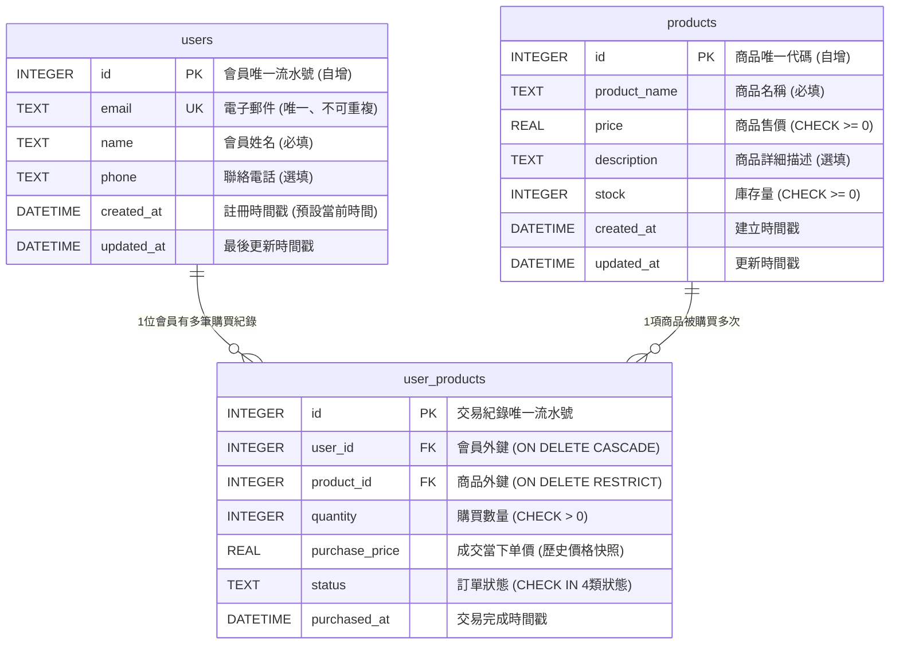
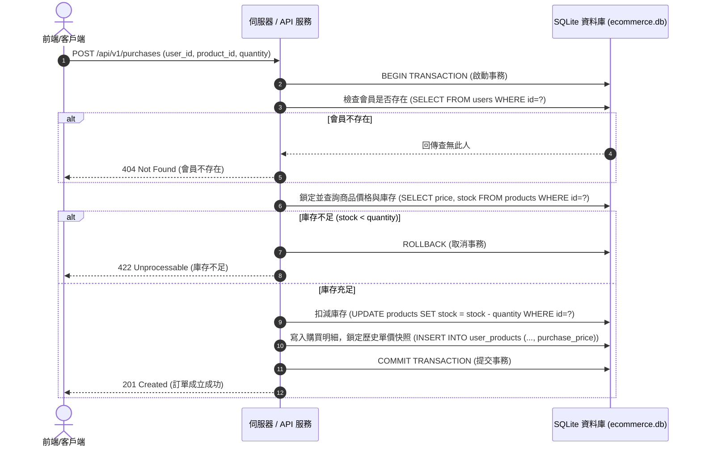

# 系統功能規格說明書 (Functional Specification, SPEC)

## 專案名稱：電商會員與購買紀錄管理系統 (E-Commerce Member & Purchase Management System)

---

| 項目 | 內容說明 |
| :--- | :--- |
| **文件版本** | v1.1.0 |
| **文件狀態** | 正式版本 (Approved) |
| **對應 PRD** | [產品需求規格書 (prd.md)](file:///c:/Users/ANGEL/OneDrive/Documents/AI%20PM%20WEEK6/prd.md) |
| **最後更新** | 2026-09-05 |
| **作者 / 負責人** | AI PM / Antigravity |

---

## 一、功能概述／目標 (Overview & Objectives)

### 1.1 解決的問題
在傳統微型電商、原型系統（MVP）或內部營運管理中，常遭遇以下核心問題：
1. **資料孤島與關聯性缺乏**：會員、商品與消費紀錄缺乏嚴謹的外鍵約束與關聯模型，容易產生孤兒資料或髒資料。
2. **歷史交易帳務失真**：若商品後續調漲或促銷特價，直接關聯商品當前售價將導致過往「歷史購買紀錄」的金額被連帶竄改，使財務核算嚴重錯誤。
3. **資料匯出格式不相容**：將資料表匯出為 CSV 在繁體中文 Windows Excel 開啟時，經常因編碼缺少 BOM 而產生難以辨識的亂碼。
4. **缺乏輕量直觀的檢視工具**：後台開發前，營運與業務人員缺乏免安裝複雜資料庫軟體、雙擊即可開箱檢視與篩選資料的視覺化工具。

### 1.2 預期達成的目標
* **建立穩固的關聯資料庫模型**：以 SQLite 實作包含會員 (`users`)、商品 (`products`) 與購買明細 (`user_products`) 的資料表，具備主外鍵連動、CHECK 約束與查詢索引。
* **實現歷史價格快照機制**：在交易紀錄表中固化下單時的「成交單價 (`purchase_price`)」，確保商品後續改價不影響過往帳目。
* **一鍵全自動管線**：
  * 提供可隨時重置與模擬真實情境的資料庫種子注入腳本（12 會員、14 商品、30 筆交易）。
  * 支援動態掃描所有資料表並匯出對應名稱、相容 Windows Excel 防亂碼的 CSV 檔案。
  * 透過零依賴 Python 腳本產生單檔、免聯網、具備多表分頁與即時搜尋的現代化 HTML 儀表板。
* **標準化 API 介面規範**：規劃未來升級為 Web 服務時的 RESTful API 規格，涵蓋會員、商品、下單交易與訂單狀態流轉。

---

## 二、使用情境／使用者故事 (User Personas & User Stories)

| 編號 | 角色 (Who) | 使用情境 (When / Context) | 目標行動 (What) | 預期價值 (Why / Value) |
| :---: | :--- | :--- | :--- | :--- |
| **US-01** | **電商營運人員** | 每日進行會員服務與訂單追蹤時 | 透過獨立的 HTML 儀表板檢視會員購買紀錄，並使用搜尋列快速搜尋買家或商品名稱 | 無需安裝任何資料庫管理工具，即可在任何瀏覽器中秒開查帳與處理客戶諮詢。 |
| **US-02** | **產品經理 / 資料分析師** | 週期性分析各商品熱銷度與會員消費力時 | 執行 CSV 匯出腳本取得個別資料表的 CSV 檔案，並在 Windows Excel 中直接開啟 | 匯出結果自動具備 UTF-8 BOM，繁體中文不亂碼，方便直接進行樞紐分析與報表彙整。 |
| **US-03** | **電商消費者 (會員)** | 瀏覽電商平台進行購物與下單時 | 填寫 Email 與姓名註冊會員，選取欲購買的商品數量並送出訂單 | 能在系統中留下明確的購買明細，並以當時成交價成立訂單，享有正確的歷史紀錄。 |
| **US-04** | **後端 / 全端工程師** | 開發或串接前端管理後台與購物車時 | 調用標準 RESTful API 介面執行會員註冊、商品上架與訂單建立 | 介面規範明確、錯誤代碼統一，且底層資料庫具備外鍵保護，杜絕資料不一致的風險。 |

---

## 三、功能需求 (Functional Requirements)

以下為本系統各核心功能模組的具體行為與業務規則：

### 3.1 會員管理功能 (User Management)
* **FR-USR-01 (唯一信箱註冊)**：系統必須確保 `email` 欄位全局唯一（UNIQUE）。若使用者以已存在的 Email 嘗試註冊，資料庫必須拒絕寫入並回報錯誤。
* **FR-USR-02 (必填欄位驗證)**：會員姓名 (`name`) 與電子郵件 (`email`) 為絕對必填項，不允許空值 (`NOT NULL`) 或空字串。
* **FR-USR-03 (彈性電話格式)**：電話欄位 (`phone`) 為選填，因應各國電話格式、手機分機或連字號，系統必須以文字型別 (`TEXT`) 儲存。
* **FR-USR-04 (時間戳自動化)**：會員註冊時間 (`created_at`) 與異動時間 (`updated_at`) 必須由資料庫在寫入時自動生成當前時間（UTC）。

### 3.2 商品與庫存管理功能 (Product & Inventory Management)
* **FR-PRD-01 (商品上架規範)**：商品名稱 (`product_name`) 為必填項，字元長度限制於 1 至 255 字元之間。
* **FR-PRD-02 (非負價格約束)**：商品牌價 (`price`) 必須大於等於 0（`CHECK(price >= 0)`），系統嚴格禁止任何負數價格商品上架。
* **FR-PRD-03 (庫存防護機制)**：商品庫存 (`stock`) 預設值為 0，且數值必須為非負整數（`CHECK(stock >= 0)`）。
* **FR-PRD-04 (防意外誤刪保護)**：若某項商品已存在於購買紀錄 (`user_products`) 中，資料庫必須強制限制刪除（`ON DELETE RESTRICT`），避免歷史帳目關聯斷裂。

### 3.3 會員購買紀錄與單價快照功能 (Purchase & Snapshot Management)
* **FR-PUR-01 (購買明細關聯)**：每一筆購買紀錄必須同時關聯至有效的會員 ID (`user_id`) 與商品 ID (`product_id`)。若傳入不存在的 ID，系統必須觸發外鍵錯誤中斷操作。
* **FR-PUR-02 (購買數量約束)**：購買件數 (`quantity`) 預設為 1，且必須大於 0（`CHECK(quantity > 0)`）。
* **FR-PUR-03 (成交單價歷史快照)**：購買紀錄必須包含 `purchase_price` 欄位。在訂單建立當下，系統必須自動抓取該商品的當前價格寫入此欄位。日後即便商品牌價調漲或降價，歷史紀錄之 `purchase_price` 保持不變。
* **FR-PUR-04 (訂單狀態流轉約束)**：訂單狀態 (`status`) 預設為 `'completed'`，且僅允許在 `'pending'`, `'completed'`, `'cancelled'`, `'refunded'` 四種合法狀態中流轉。
* **FR-PUR-05 (級聯清理規範)**：若某會員帳號確定註銷刪除，其關聯的購買紀錄將連帶清除（`ON DELETE CASCADE`）。

### 3.4 批次 CSV 匯出功能 (Batch CSV Export Pipeline)
* **FR-CSV-01 (資料表動態探索)**：系統必須自動查詢資料庫中所有現存的實體表（排除 SQLite 內部系統表如 `sqlite_sequence`），有幾張實體表就自動生成幾張 CSV。
* **FR-CSV-02 (檔名合約)**：輸出的 CSV 檔案名稱必須嚴格對應資料表名稱，格式為 `[table_name].csv`（如 `users.csv`, `products.csv`, `user_products.csv`）。
* **FR-CSV-03 (RFC 4180 標準相容)**：欄位若包含逗號 `,`、半形雙引號 `"` 或換行符號 (`\r`, `\n`)，必須以雙引號包裹，且內部雙引號需轉義為 `""`。
* **FR-CSV-04 (Windows Excel 防亂碼機制)**：產出的 CSV 檔案頭部必須寫入 UTF-8 BOM（位元組 `\uFEFF`），確保在繁體中文 Windows 版 Excel 開啟時不產生亂碼。

### 3.5 Python 視覺化報表生成功能 (Python HTML Dashboard Engine)
* **FR-VSH-01 (零外部依賴)**：報表生成腳本必須僅使用 Python 原生內建標準庫（`sqlite3`, `os`, `sys`, `html`, `datetime`），不得強制要求安裝第三方 pip 套件。
* **FR-VSH-02 (三表整合關聯視圖)**：購買紀錄表除顯示外鍵代碼外，必須透過 SQL JOIN 自動帶出買家姓名、買家信箱與商品名稱。
* **FR-VSH-03 (多分頁切換)**：HTML 介面必須提供 Tab 分頁，可流暢切換檢視 `user_products`、`users`、`products` 三大資料表。
* **FR-VSH-04 (動態即打即找過濾)**：右上角搜尋框在使用者鍵入文字時，必須以即時動態方式隱藏不符合關鍵字的列。
* **FR-VSH-05 (營運關鍵指標卡片)**：頁面頂部必須動態計算並呈現：會員總數、商品總數、購買訂單數、已完成訂單累計營業額。
* **FR-VSH-06 (狀態彩色徽章)**：依據訂單狀態呈現色彩語義（已完成為綠色、處理中為黃色、已退款為紅色、已取消為灰色）。

---

## 四、資料模型 (Data Model)

### 4.1 實體關聯模型 (Entity Relationship Diagram)



### 4.2 資料字典規格表 (Data Dictionary)

#### 1. 會員表：`users` (視圖別名：`user`)
| 欄位名稱 (Field) | 資料型別 (Type) | 鍵值 (Key) | 空值限制 (Null) | 預設值 (Default) | 欄位定義與約束規則 |
| :--- | :--- | :---: | :---: | :--- | :--- |
| `id` | `INTEGER` | **PK** | NOT NULL | 自增 | 會員流水號識別碼 |
| `email` | `TEXT` | **UK** | NOT NULL | 無 | 會員登入與通知信箱，全系統唯一 |
| `name` | `TEXT` | - | NOT NULL | 無 | 會員真實姓名或顯示稱謂 |
| `phone` | `TEXT` | - | NULL | NULL | 聯絡電話號碼（支援連字號） |
| `created_at` | `DATETIME` | - | NOT NULL | `CURRENT_TIMESTAMP` | 帳號建立之 UTC 時間 |
| `updated_at` | `DATETIME` | - | NOT NULL | `CURRENT_TIMESTAMP` | 資料最後變更之 UTC 時間 |

#### 2. 商品表：`products` (視圖別名：`product`)
| 欄位名稱 (Field) | 資料型別 (Type) | 鍵值 (Key) | 空值限制 (Null) | 預設值 (Default) | 欄位定義與約束規則 |
| :--- | :--- | :---: | :---: | :--- | :--- |
| `id` | `INTEGER` | **PK** | NOT NULL | 自增 | 商品唯一代碼 |
| `product_name` | `TEXT` | - | NOT NULL | 無 | 商品名稱規格 |
| `price` | `REAL` | - | NOT NULL | 無 | 當前上架單價，限制 `price >= 0` |
| `description` | `TEXT` | - | NULL | NULL | 商品文案介紹與備註 |
| `stock` | `INTEGER` | - | NOT NULL | `0` | 現有庫存總量，限制 `stock >= 0` |
| `created_at` | `DATETIME` | - | NOT NULL | `CURRENT_TIMESTAMP` | 上架時間戳 |
| `updated_at` | `DATETIME` | - | NOT NULL | `CURRENT_TIMESTAMP` | 規格異動時間戳 |

#### 3. 購買明細表：`user_products` (視圖別名：`user_product`)
| 欄位名稱 (Field) | 資料型別 (Type) | 鍵值 (Key) | 空值限制 (Null) | 預設值 (Default) | 欄位定義與約束規則 |
| :--- | :--- | :---: | :---: | :--- | :--- |
| `id` | `INTEGER` | **PK** | NOT NULL | 自增 | 購買明細唯一流水號 |
| `user_id` | `INTEGER` | **FK** | NOT NULL | 無 | 關聯 `users(id)`，`CASCADE` 刪除 |
| `product_id` | `INTEGER` | **FK** | NOT NULL | 無 | 關聯 `products(id)`，`RESTRICT` 刪除 |
| `quantity` | `INTEGER` | - | NOT NULL | `1` | 購買件數，限制 `quantity > 0` |
| `purchase_price` | `REAL` | - | NOT NULL | 無 | **歷史單價快照**，限制 `purchase_price >= 0` |
| `status` | `TEXT` | - | NOT NULL | `'completed'` | 狀態：`pending`/`completed`/`cancelled`/`refunded` |
| `purchased_at` | `DATETIME` | - | NOT NULL | `CURRENT_TIMESTAMP` | 交易發生時間戳 |

#### 4. 索引結構規劃 (Indexes)
* `idx_user_products_user_id`：建立於 `user_products(user_id)`，最佳化會員個人購買清單檢索效能。
* `idx_user_products_product_id`：建立於 `user_products(product_id)`，最佳化特定商品銷售統計與銷量聚合。

---

## 五、介面／API 定義 (Interface / API Definitions)

為滿足後續前後端分離與微服務架構整合，本系統規劃標準 RESTful JSON API 介面規範如下：

### 5.1 通用錯誤回應結構 (Error Response Schema)
當 API 呼叫失敗時，一律回傳符合 RFC 7807 標準之 JSON 格式：
```json
{
  "success": false,
  "error": {
    "code": "RESOURCE_ALREADY_EXISTS",
    "message": "該 Email (alice@example.com) 已被註冊",
    "details": { "field": "email" },
    "timestamp": "2026-09-05T15:00:00Z"
  }
}
```

### 5.2 端點詳細規格 (Endpoints)

#### (1) 會員註冊
* **Method & Path**：`POST /api/v1/users`
* **請求標頭**：`Content-Type: application/json`
* **Request Body**：
  ```json
  {
    "email": "user@example.com",
    "name": "王小明",
    "phone": "0912-345-678"
  }
  ```
* **Success Response (`201 Created`)**：
  ```json
  {
    "success": true,
    "data": {
      "id": 13,
      "email": "user@example.com",
      "name": "王小明",
      "phone": "0912-345-678",
      "created_at": "2026-09-05 07:00:00"
    }
  }
  ```
* **Error Response**：
  * `400 Bad Request`：缺少必要欄位（如 `email` 或 `name` 為空）。
  * `409 Conflict`：該 Email 已存在。

---

#### (2) 取得會員清單 (支援搜尋與分頁)
* **Method & Path**：`GET /api/v1/users`
* **Query Parameters**：
  * `page` (選填, 預設 1)
  * `limit` (選填, 預設 20)
  * `q` (選填, 搜尋姓名或 Email 關鍵字)
* **Success Response (`200 OK`)**：
  ```json
  {
    "success": true,
    "data": {
      "items": [
        {
          "id": 1,
          "email": "alice.chen@example.com",
          "name": "陳雅婷 (Alice)",
          "phone": "0912-345-678",
          "created_at": "2026-01-10 09:20:00"
        }
      ],
      "pagination": { "page": 1, "limit": 20, "total": 12 }
    }
  }
  ```

---

#### (3) 取得商品型錄
* **Method & Path**：`GET /api/v1/products`
* **Success Response (`200 OK`)**：
  ```json
  {
    "success": true,
    "data": [
      {
        "id": 1,
        "product_name": "iPhone 16 Pro 256GB",
        "price": 36900.0,
        "description": "Apple 原廠旗艦機",
        "stock": 15,
        "created_at": "2026-09-05 06:36:12"
      }
    ]
  }
  ```

---

#### (4) 建立購買交易訂單 (下單)
* **Method & Path**：`POST /api/v1/purchases`
* **業務規則**：後端接收到請求後，自動開啟資料庫事務（Transaction），查詢該商品的當前價格寫入 `purchase_price` 快照欄位，並驗證/扣除庫存。
* **Request Body**：
  ```json
  {
    "user_id": 1,
    "product_id": 4,
    "quantity": 2
  }
  ```
* **Success Response (`201 Created`)**：
  ```json
  {
    "success": true,
    "data": {
      "id": 31,
      "user_id": 1,
      "product_id": 4,
      "quantity": 2,
      "purchase_price": 590.0,
      "subtotal": 1180.0,
      "status": "completed",
      "purchased_at": "2026-09-05 07:15:00"
    }
  }
  ```
* **Error Response**：
  * `404 Not Found`：`user_id` 或 `product_id` 不存在。
  * `422 Unprocessable Entity`：商品庫存不足或數量小於 1。

---

#### (5) 查詢購買交易明細 (多表整合視圖)
* **Method & Path**：`GET /api/v1/purchases`
* **Query Parameters**：
  * `user_id` (選填, 依會員篩選)
  * `status` (選填, 依狀態篩選)
* **Success Response (`200 OK`)**：
  ```json
  {
    "success": true,
    "data": [
      {
        "id": 1,
        "user": { "id": 1, "name": "陳雅婷 (Alice)", "email": "alice.chen@example.com" },
        "product": { "id": 1, "product_name": "iPhone 16 Pro 256GB" },
        "quantity": 1,
        "purchase_price": 36900.0,
        "subtotal": 36900.0,
        "status": "completed",
        "purchased_at": "2026-02-01 10:30:00"
      }
    ]
  }
  ```

---

#### (6) 更新訂單狀態
* **Method & Path**：`PATCH /api/v1/purchases/:id/status`
* **Request Body**：
  ```json
  {
    "status": "refunded"
  }
  ```
* **Success Response (`200 OK`)**：
  ```json
  {
    "success": true,
    "data": { "id": 1, "status": "refunded", "updated_at": "2026-09-05 07:20:00" }
  }
  ```
* **Error Response**：
  * `400 Bad Request`：傳入不合法狀態值（非 `pending`/`completed`/`cancelled`/`refunded`）。

---

## 六、流程與邊界條件 (Process Flows & Edge Cases)

### 6.1 核心下單購買處理時序流程 (Happy Path & Rollback)



### 6.2 邊界條件與例外處理清單 (Edge Cases Matrix)

| 邊界/例外情況 | 發生場景 | 系統防禦與處理策略 |
| :--- | :--- | :--- |
| **信箱重複註冊** | 使用者以已被註冊之 Email 建立新帳號 | 資料庫端藉由 `UNIQUE` 約束拒絕；API 層攔截 `SQLITE_CONSTRAINT_UNIQUE` 例外並回傳 `409 Conflict` 與友善提示訊息。 |
| **負數金額或庫存** | 建立或修改商品時傳入負數數值 | 資料庫 `CHECK(price >= 0)` 及 `CHECK(stock >= 0)` 約束自動拒絕執行，API 層回傳 `400 Bad Request`。 |
| **刪除已有訂單之商品** | 後台人員試圖刪除已被購買過的熱門商品 | 資料庫 `ON DELETE RESTRICT` 觸發外鍵保護拒絕刪除，提示「該商品已有歷史訂單，不可刪除；請使用下架功能」。 |
| **商品價格後續異動** | 商品原價 \$36,900，隔月促銷降為 \$32,900 | 過去已建立之訂單其 `purchase_price` 依舊為 \$36,900，計算累計營收與報表時不受商品主表變動干擾。 |
| **CSV 特殊字元外溢** | 商品描述或姓名中含有英文逗號 `,` 或雙引號 `"` | 匯出腳本遵照 RFC 4180 標準，自動將內容外層加上雙引號，並將內部雙引號跳脫為 `""`，防止 CSV 欄位錯位。 |
| **Excel 開啟中文亂碼** | 在繁體中文 Windows 雙擊開啟 CSV 檔 | 匯出檔案一律在二進制開頭注入 UTF-8 BOM (`\xEF\xBB\xBF` 或 `\uFEFF`)，強制指示 Excel 以 UTF-8 格式解碼。 |
| **資料庫完全無資料 (空表)** | 全新建立的資料庫執行報表輸出 | 匯出 CSV 模組產出僅含表頭（Header）的檔案；HTML 報表呈現「目前無資料」之空狀態提示，不報錯崩潰。 |

---

## 七、驗收標準 (Acceptance Criteria, AC)

本規格書之驗收基準採條列可量化方式驗收，所有項目皆須具備可驗證證據：

- [x] **AC-01 (資料庫與表結構建立)**：
  - 成功建立實體資料庫 [`ecommerce.db`](file:///c:/Users/ANGEL/OneDrive/Documents/AI%20PM%20WEEK6/ecommerce.db)。
  - 包含 `users`、`products`、`user_products` 3 張完整實體表與對應的單數別名 View (`user`, `product`, `user_product`)。
- [x] **AC-02 (約束機制實測驗證)**：
  - 外鍵約束在連線時生效 (`PRAGMA foreign_keys = ON;`)。
  - `email` 具備唯一性；價格與數量具備非負數與大於 0 之 CHECK 限制。
- [x] **AC-03 (測試種子資料完備性)**：
  - 執行 [`seed_data.js`](file:///c:/Users/ANGEL/OneDrive/Documents/AI%20PM%20WEEK6/seed_data.js) 需於 3 秒內無誤執行，注入 12 位會員、14 款商品與 30 筆涵蓋不同狀態的購買明細。
  - 控制台輸出會員消費排行榜 Top 5、商品銷量排行榜 Top 5 與訂單狀態摘要。
- [x] **AC-04 (CSV 匯出規格相符)**：
  - 執行 [`export_csv.js`](file:///c:/Users/ANGEL/OneDrive/Documents/AI%20PM%20WEEK6/export_csv.js) 能自動掃描並產出 [`users.csv`](file:///c:/Users/ANGEL/OneDrive/Documents/AI%20PM%20WEEK6/users.csv)、[`products.csv`](file:///c:/Users/ANGEL/OneDrive/Documents/AI%20PM%20WEEK6/products.csv) 與 [`user_products.csv`](file:///c:/Users/ANGEL/OneDrive/Documents/AI%20PM%20WEEK6/user_products.csv)。
  - 產出檔案包含 UTF-8 BOM，在 Windows Excel 中雙擊開啟無任何亂碼。
- [x] **AC-05 (Python HTML 視覺化報表)**：
  - 執行 [`export_html.py`](file:///c:/Users/ANGEL/OneDrive/Documents/AI%20PM%20WEEK6/export_html.py) 產出 [`database_view.html`](file:///c:/Users/ANGEL/OneDrive/Documents/AI%20PM%20WEEK6/database_view.html)。
  - 儀表板包含四張指標卡片（會員數 12、商品數 14、購買數 30、完成金額 NT$ 200,910）。
  - 具備 3 個 Tab 標籤切換與右上角即時搜尋輸入框。
- [x] **AC-06 (規格文件完整性)**：
  - 本規格書包含完整之概述、使用者故事、功能需求、資料模型、API 規格、流程與邊界條件、驗收標準與技術限制。

---

## 八、技術棧／限制（選配） (Tech Stack & Constraints)

### 8.1 技術棧清單 (Technology Stack)
* **資料庫引擎**：SQLite 3.x（單一檔案資料庫 `ecommerce.db`）
* **腳本與資料庫維運**：
  * Node.js v24.20.0（採用內建原生 `node:sqlite` 與 `node:fs` 模組）
  * SQL 標準語法（相容 ANSI SQL-92 / SQLite 方言）
* **資料分析與報表引擎**：
  * Python 3.12.10（使用內建標準庫 `sqlite3`, `html`, `sys`, `os`）
* **前端展示與樣式**：
  * HTML5、CSS3（採用現代 Tailwind 語義調色盤與 Flex/Grid 佈局）
  * 原生 Vanilla JavaScript（負責 Tab 切換與 DOM 動態過濾搜尋）
  * 現存專案前端相容環境：React 18.3.1 + Vite 5.4.11

### 8.2 系統限制與架構約束 (System Constraints)
1. **單機寫入併發限制**：
   * SQLite 在寫入操作時會鎖定資料庫檔案（Database-level write lock）。本系統定位於中小型應用、原型驗證（MVP）或內部營運報表，高併發寫入需求（如秒殺搶購）未來需平滑遷移至 PostgreSQL 或 MySQL。
2. **零外部相依政策 (Zero-Dependency Policy)**：
   * 本專案後端管線工具不引入額外的 npm 或 pip 外部套件，降低環境建置與 CI/CD 失敗風險。
3. **離線與跨平台保證 (Offline-First)**：
   * 所有 HTML/CSS/JS 代碼採完全內嵌形式，即使在無外部網際網路連線之封閉內網環境，亦可雙擊秒開儀表板。
4. **字元集強制約束**：
   * 全流程強制規範 UTF-8 編碼；任何涉及產出 CSV 供外部試算表閱讀之管道，強制附加 UTF-8 BOM。
