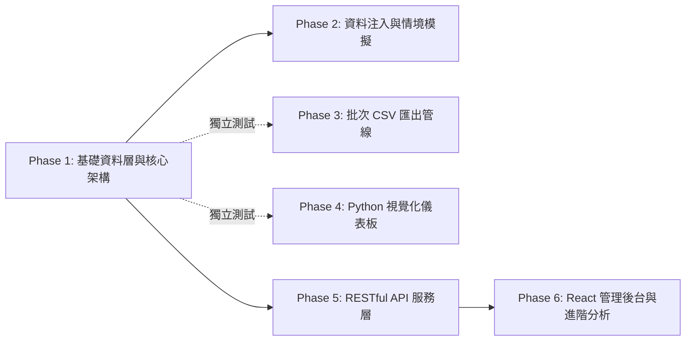

# 專案任務清單與實施規劃 (TODO List)

## 專案名稱：電商會員與購買紀錄管理系統 (E-Commerce Member & Purchase Management System)

---

| 項目 | 內容說明 |
| :--- | :--- |
| **文件版本** | v1.0.0 |
| **關聯規格** | [spec.md (功能規格書)](file:///c:/Users/ANGEL/OneDrive/Documents/AI%20PM%20WEEK6/spec.md) \| [prd.md (需求規格書)](file:///c:/Users/ANGEL/OneDrive/Documents/AI%20PM%20WEEK6/prd.md) |
| **規劃原則** | 兩層式階層架構、由基礎至進階漸進式推進、各階段低耦合且可獨立測試驗證 |
| **狀態圖例** | `[x]` 已完成實測驗收 \| `[ ]` 待開發/進階規劃 |

---

## 總覽：階段劃分與相依關係

> **架構解耦說明**：
> * **Phase 1 ~ Phase 4** 已實作完畢，彼此僅相依於 SQLite 底層檔案，任一模組皆可隨時獨立執行與單元測試。
> * **Phase 5 & Phase 6** 為進階規劃，可基於現有資料庫平滑擴充，不影響既有匯出與報表工具之運作。

---

## Phase 1：基礎資料層與資料庫核心架構 (Foundational Schema & Core Database)

> **階段目標**：建立具備 ACID 保證、外鍵約束、數值檢查與索引優化的 SQLite 核心資料模型。  
> **解耦與測試方式**：無需任何外部工具，僅需透過 SQL 執行器或內建連線測試 DDL 語法與約束觸發。

- [x] **1.1 資料庫結構定義 (DDL Specification)**
  - [x] 編寫 [`schema.sql`](file:///c:/Users/ANGEL/OneDrive/Documents/AI%20PM%20WEEK6/schema.sql)，強制啟用 `PRAGMA foreign_keys = ON;` 連線保護。
  - [x] 定義會員表 `users`：設定 `id` 主鍵自增、`email` 全域唯一 (`UNIQUE`)、`name` 必填與時間戳。
  - [x] 定義商品表 `products`：設定 `id` 主鍵自增、`product_name`、`price` 非負檢查 (`CHECK(price >= 0)`)、庫存量 (`CHECK(stock >= 0)`)。
  - [x] 定義購買關聯表 `user_products`：設定雙外鍵約束（`users` 級聯刪除、`products` 限制刪除）、購買量檢查 (`quantity > 0`) 與**歷史單價快照欄位 (`purchase_price`)**。
  - [x] 定義訂單狀態欄位：限制狀態值僅能為 `pending`、`completed`、`cancelled`、`refunded`。

- [x] **1.2 效能優化與開發者體驗 (Indexes & Views)**
  - [x] 建立查詢效能索引：`idx_user_products_user_id`（加速會員歷史查詢）、`idx_user_products_product_id`（加速商品銷量統計）。
  - [x] 建立單數命名視圖：`user`、`product`、`user_product`，相容單複數命名之 SQL 開發習慣。

- [x] **1.3 獨立驗證與單元測試 (Unit Test & Verification)**
  - [x] 驗證反向約束：寫入重複 Email 時應觸發 `SQLITE_CONSTRAINT_UNIQUE` 阻擋。
  - [x] 驗證價格防護：寫入負數售價或負數庫存時應觸發 `CHECK constraint failed` 阻擋。
  - [x] 驗證外鍵保護：關聯不存在的 `user_id` 或試圖刪除已有訂單之商品時應觸發外鍵異常。

---

## Phase 2：資料注入與業務情境模擬 (Data Seeding & Business Simulation)

> **階段目標**：建構可重複執行的一鍵種子資料注入模組，涵蓋多元化、真實商業情境的資料分佈與彙總報表驗證。  
> **解耦與測試方式**：執行單一腳本 `node seed_data.js`，可獨立重建資料表並於控制台即時輸出驗算結果。

- [x] **2.1 種子資料腳本實作 (Seeding Engine)**
  - [x] 編寫自動化注入腳本 [`seed_data.js`](file:///c:/Users/ANGEL/OneDrive/Documents/AI%20PM%20WEEK6/seed_data.js)（使用 Node.js 內建 `node:sqlite`）。
  - [x] 產出純 SQL 種子檔 [`seed.sql`](file:///c:/Users/ANGEL/OneDrive/Documents/AI%20PM%20WEEK6/seed.sql)，供外部視覺化 GUI 工具直接匯入。

- [x] **2.2 擬真情境數據覆蓋 (Scenario Datasets)**
  - [x] 寫入 12 位會員資料（涵蓋常見姓名、不同註冊月份、格式化聯絡電話）。
  - [x] 寫入 14 款商品資料（涵蓋旗艦 3C、辦公周邊、咖啡生活、背包配件，包含高低價位與不同庫存水位）。
  - [x] 寫入 30 筆購買明細（涵蓋多品項下單、折扣促銷歷史成交價快照、多種交易狀態分佈）。

- [x] **2.3 商業指標彙總與獨立驗證 (Independent Verification)**
  - [x] 驗證會員累積消費榜：聚合計算 `status = 'completed'` 之 Top 5 消費金額（驗證 Charlie 以 \$46,270 居冠）。
  - [x] 驗證商品熱銷榜：聚合計算各商品銷售件數與營收（驗證濾掛咖啡組售出 5 件居冠）。
  - [x] 驗證狀態分佈統計：覆蓋已完成 25 筆、待處理 3 筆、已退款 1 筆與已取消 1 筆。

---

## Phase 3：批次 CSV 匯出與防亂碼管線 (Data Export & Interoperability)

> **階段目標**：提供無外部套件依賴之資料表自動探測與批次匯出管線，保證產出與 Windows Excel 完全相容之 CSV。  
> **解耦與測試方式**：直接執行 `node export_csv.js`，驗證產出之 CSV 檔案數量、命名與二進制編碼標頭。

- [x] **3.1 動態資料表探索模組 (Dynamic Table Discovery)**
  - [x] 編寫匯出管線腳本 [`export_csv.js`](file:///c:/Users/ANGEL/OneDrive/Documents/AI%20PM%20WEEK6/export_csv.js)。
  - [x] 透過查詢 `sqlite_master` 動態探測所有使用者實體表，排除系統表，實現「有幾張表就產出幾張 CSV」的彈性機制。

- [x] **3.2 RFC 4180 格式化與 Excel 防亂碼 (Formatting & BOM)**
  - [x] 實作嚴格的 RFC 4180 字串跳脫函數：對逗號 `,`、引號 `"` 及換行符號自動以雙引號包裹，內部引號跳脫為 `""`。
  - [x] 注入 **UTF-8 BOM (`\uFEFF`)** 於各檔案首字節，並使用 Windows CRLF 換行。
  - [x] 嚴格依照資料表名稱輸出檔案：[`users.csv`](file:///c:/Users/ANGEL/OneDrive/Documents/AI%20PM%20WEEK6/users.csv)、[`products.csv`](file:///c:/Users/ANGEL/OneDrive/Documents/AI%20PM%20WEEK6/products.csv)、[`user_products.csv`](file:///c:/Users/ANGEL/OneDrive/Documents/AI%20PM%20WEEK6/user_products.csv)。

- [x] **3.3 獨立驗證 (Independent Verification)**
  - [x] 使用 Windows Excel 實際雙擊開啟三個 CSV 檔案，確認繁體中文完全正常顯示、欄位無錯位。
  - [x] 驗證各 CSV 資料筆數與表頭完全契合資料庫現況。

---

## Phase 4：輕量化視覺報表與互動儀表板 (Analytical Engine & Web Dashboard)

> **階段目標**：使用 Python 原生模組讀取資料庫，產出具備三表切換、即時搜尋與關鍵營運指標之單檔離線 HTML 儀表板。  
> **解耦與測試方式**：執行 `python export_html.py`，並直接在任何本機瀏覽器開啟檢驗畫面渲染與前端事件。

- [x] **4.1 Python 資料讀取與安全轉義 (Python Analytical Engine)**
  - [x] 編寫 [`export_html.py`](file:///c:/Users/ANGEL/OneDrive/Documents/AI%20PM%20WEEK6/export_html.py)，僅調用標準庫（`sqlite3`, `html`, `sys`, `os`），落實零依賴政策。
  - [x] 配置終端機標準輸出 UTF-8 編碼保護，防止 Windows 預設 CP950 終端機報錯。
  - [x] 實作三表關聯查詢（JOIN 提取會員姓名、Email 與商品品名，動態計算訂單小計）。
  - [x] 全面實施 HTML 特殊字元轉義 (`html.escape`)，防止潛在 XSS 漏洞。

- [x] **4.2 現代化互動 UI 介面設計 (Dashboard Implementation)**
  - [x] 產出單一獨立檔案 [`database_view.html`](file:///c:/Users/ANGEL/OneDrive/Documents/AI%20PM%20WEEK6/database_view.html)，內嵌完整 CSS 與 JavaScript，具備離線秒開能力。
  - [x] 實作頂部 4 大營運關鍵指標卡片（會員數 12、商品數 14、購買紀錄 30、成交營業額 NT$ 200,910）。
  - [x] 實作多表分頁切換按鈕（Tabs：`user_products`、`users`、`products`）。
  - [x] 實作訂單狀態彩色語義徽章（綠色 `completed`、黃色 `pending`、紅色 `refunded`、灰色 `cancelled`）。
  - [x] 實作純前端即時動態搜尋列（搜尋框輸入文字即時過濾當前表格內容）。

- [x] **4.3 獨立驗證 (Independent Verification)**
  - [x] 透過瀏覽器開啟 [`database_view.html`](file:///c:/Users/ANGEL/OneDrive/Documents/AI%20PM%20WEEK6/database_view.html) 測試分頁點擊流暢度。
  - [x] 輸入關鍵字（如「咖啡」、「Alice」、「pending」）測試即時過濾與列切換效果。

---

## Phase 5：服務化 RESTful API 介面層 (RESTful Service Layer) [進階規劃]

> **階段目標**：將現有 SQLite 資料庫封裝為標準 RESTful HTTP 服務，支援外部客戶端與前後端分離架構。  
> **解耦與測試方式**：啟動獨立的 API 伺服器，透過 Postman、cURL 或自動化單元測試呼叫各端點，驗證 HTTP 狀態碼與 JSON Payload。

- [ ] **5.1 輕量 API 伺服器建置 (Server Initialization)**
  - [ ] 選擇使用 Node.js Express 或 Python FastAPI 搭建微型 API 服務。
  - [ ] 設定 CORS 跨域存取支援與全域 JSON 解析中介軟體 (Middleware)。
  - [ ] 實作符合 RFC 7807 的全域統一錯誤處理結構（`{ success, error: { code, message, details } }`）。

- [ ] **5.2 核心 CRUD 端點實作 (Endpoints Implementation)**
  - [ ] `GET /api/v1/users`：取得會員清單，支援分頁 (`page`, `limit`) 與關鍵字搜尋。
  - [ ] `POST /api/v1/users`：會員註冊，包含 Email 格式驗證與重複註冊 `409 Conflict` 攔截。
  - [ ] `GET /api/v1/products`：取得商品型錄與即時庫存資訊。
  - [ ] `POST /api/v1/products`：新增商品上架，驗證單價與庫存非負數規則。
  - [ ] `POST /api/v1/purchases`：建立購買訂單，落實**「資料庫事務 (Transaction)」**，自動扣減庫存並鎖定歷史單價快照。
  - [ ] `GET /api/v1/purchases`：查詢購買明細，支援多表 JOIN 視圖與依會員/狀態過濾。
  - [ ] `PATCH /api/v1/purchases/:id/status`：更新訂單狀態，驗證合法狀態轉換規則。

- [ ] **5.3 獨立整合測試 (API Integration Test)**
  - [ ] 編寫端點整合測試腳本，模擬併發下單時的庫存扣減與 Rollback 機制。
  - [ ] 驗證不合法輸入時回傳正確之 `400`、`404`、`409` 與 `422` 狀態碼。

---

## Phase 6：React 前端後台整合與進階商業分析 (React Frontend & Visual Analytics) [進階規劃]

> **階段目標**：將儀表板與管理功能完整整合進現有 Vite + React 專案，並引入互動式圖表提供深度商業洞察。  
> **解耦與測試方式**：執行 `npm run dev`，在 React 單頁應用 (SPA) 中直接操作 UI 元件與進行畫面渲染驗收。

- [ ] **6.1 React 管理後台元件化 (React Components Integration)**
  - [ ] 在現有 React 架構中建立 `components/admin/` 模組目錄。
  - [ ] 開發 `UserTable.jsx`、`ProductTable.jsx` 與 `OrderTable.jsx` 元件。
  - [ ] 整合 Lucide-React 圖示庫提升介面質感與可用性。
  - [ ] 實作彈窗表單（Modal Form）：支援線上直接新增會員、快速調整商品庫存與變更訂單狀態。

- [ ] **6.2 互動式商業分析圖表 (Interactive Analytics Dashboard)**
  - [ ] 引入圖表庫（如 Recharts 或 Chart.js）。
  - [ ] 繪製「會員消費貢獻長條圖」：直觀展示高價值 VIP 客戶排名。
  - [ ] 繪製「各品類商品營收佔比圓餅圖」：分析主力熱銷品項。
  - [ ] 繪製「訂單狀態分佈甜甜圈圖」：即時監控退款率與取消率。

- [ ] **6.3 端到端綜合驗收 (E2E Verification)**
  - [ ] 模擬完整使用者路徑：於前端介面註冊會員 $\to$ 瀏覽商品 $\to$ 點擊下單 $\to$ 觀察庫存減少與訂單圖表即時更新。
  - [ ] 執行 Vite 生產構建 (`npm run build`)，確保零警告與型別無誤產出。
